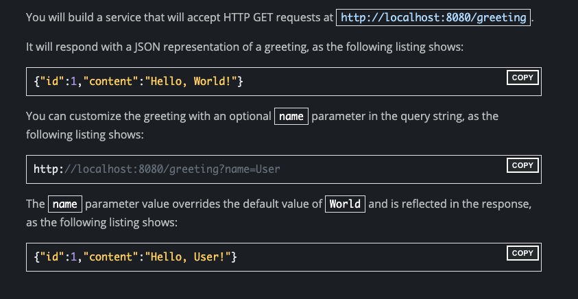

# Java Spring Boot RESTful JSON Web Service

This repository contains working code demonstrating a simple Spring Boot RESTful JSON Web Service.

##Using the Sample Code
This example is completely independent and self-contained.

##What the results look like:

##Running the Samples From the Command Line
Once cloned, you can easily run this example directly from the command line with Gradle or Maven. 

You can also build a single executable JAR file that contains all the necessary dependencies, classes, and resources 
and run that. Building an executable jar makes it easy to ship, version, and deploy the service as an application 
throughout the development lifecycle, across different environments, and so forth.

If you use Gradle, you can run the application by using:
>./gradlew bootRun. 

Alternatively, you can build the JAR file by using:
>./gradlew build 
 
and then run the JAR file, as follows:

>java -jar build/libs/gs-rest-service-0.1.0.jar

If you use Maven, you can run the application by using:
>./mvnw spring-boot:run. 

Alternatively, you can build the JAR 
file with: 
>./mvnw clean package 

and then run the JAR file, as follows:

>java -jar target/gs-rest-service-0.1.0.jar
> 
> 
